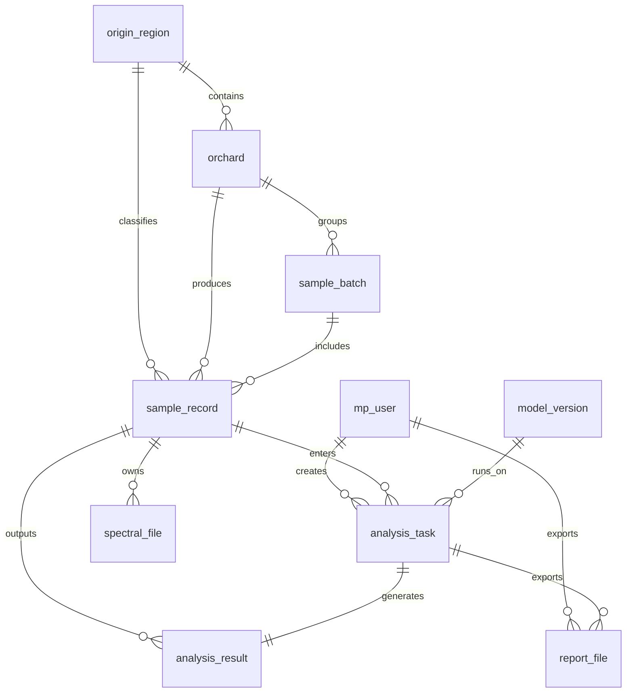

# 微信小程序数据库设计

## 1. 设计目标

数据库需要同时支撑以下能力：

- 微信用户登录
- 产地与果园基础信息维护
- 样本与批次管理
- 光谱文件与原始数据引用
- 分析任务与分析结果沉淀
- AI 报告与导出记录
- 操作审计与问题追踪

生产环境建议使用 MySQL 8.0，字符集统一为 `utf8mb4`。

## 2. 命名约定

- 表名使用小写下划线风格
- 主键统一 `id`
- 时间字段统一 `created_at`、`updated_at`
- 逻辑状态尽量用 `status` 字段
- 唯一业务编号尽量单独建唯一索引

## 3. 实体关系总览

## 4. 核心表设计

## 4.1 用户表 `mp_user`

用途：保存微信用户身份与登录信息。

| 字段 | 类型 | 说明 |
| --- | --- | --- |
| id | bigint | 主键 |
| open_id | varchar(64) | 微信 openid，唯一 |
| union_id | varchar(64) | 微信 unionid，可空 |
| nickname | varchar(64) | 昵称 |
| avatar_url | varchar(255) | 头像 |
| mobile | varchar(20) | 手机号，可空 |
| role_code | varchar(32) | 角色编码，默认 `viewer` |
| status | tinyint | 1 启用，0 停用 |
| last_login_at | datetime | 最后登录时间 |
| created_at | datetime | 创建时间 |
| updated_at | datetime | 更新时间 |

索引建议：

- `uk_open_id(open_id)`
- `idx_role_code(role_code)`

## 4.2 产地表 `origin_region`

用途：保存产地基础信息。

| 字段 | 类型 | 说明 |
| --- | --- | --- |
| id | bigint | 主键 |
| origin_code | varchar(32) | 产地编码，唯一 |
| display_name | varchar(64) | 展示名称，如“澄迈福橙” |
| province | varchar(32) | 省 |
| city | varchar(32) | 市 |
| county | varchar(32) | 区县 |
| description | varchar(255) | 说明 |
| status | tinyint | 1 启用，0 停用 |
| created_at | datetime | 创建时间 |
| updated_at | datetime | 更新时间 |

索引建议：

- `uk_origin_code(origin_code)`

## 4.3 果园表 `orchard`

用途：保存果园或基地信息。

| 字段 | 类型 | 说明 |
| --- | --- | --- |
| id | bigint | 主键 |
| origin_id | bigint | 所属产地 ID |
| orchard_code | varchar(32) | 果园编码，唯一 |
| orchard_name | varchar(64) | 果园名称 |
| owner_name | varchar(64) | 负责人 |
| contact_phone | varchar(20) | 联系电话 |
| latitude | decimal(10,6) | 纬度 |
| longitude | decimal(10,6) | 经度 |
| altitude | decimal(8,2) | 海拔，可空 |
| remark | varchar(255) | 备注 |
| status | tinyint | 状态 |
| created_at | datetime | 创建时间 |
| updated_at | datetime | 更新时间 |

索引建议：

- `uk_orchard_code(orchard_code)`
- `idx_origin_id(origin_id)`

## 4.4 批次表 `sample_batch`

用途：保存一次采样或一次检测批次。

| 字段 | 类型 | 说明 |
| --- | --- | --- |
| id | bigint | 主键 |
| batch_no | varchar(40) | 批次号，唯一 |
| orchard_id | bigint | 果园 ID |
| sample_type | varchar(32) | 样本类型，如 `single`、`compare`、`batch` |
| collected_by | varchar(64) | 采样人 |
| collected_at | datetime | 采样时间 |
| sample_count | int | 样本数 |
| upload_source | varchar(32) | 数据来源 |
| status | varchar(32) | 批次状态 |
| created_at | datetime | 创建时间 |
| updated_at | datetime | 更新时间 |

索引建议：

- `uk_batch_no(batch_no)`
- `idx_orchard_id(orchard_id)`

## 4.5 样本表 `sample_record`

用途：保存单个样本核心业务数据，是最重要的主表。

| 字段 | 类型 | 说明 |
| --- | --- | --- |
| id | bigint | 主键 |
| batch_id | bigint | 所属批次 ID |
| sample_code | varchar(40) | 样本编号，唯一 |
| external_code | varchar(40) | 外部编号 |
| origin_id | bigint | 实际产地 ID |
| orchard_id | bigint | 果园 ID |
| fruit_no | varchar(40) | 果实编号，可空 |
| current_status | varchar(32) | 当前状态，如 `new`、`warning`、`reviewed` |
| quality_grade | varchar(16) | 品级，如 `A`、`B` |
| collected_at | datetime | 采样时间 |
| ssc | decimal(8,2) | 糖度 |
| ta | decimal(8,3) | 酸度 |
| sugar_acid_ratio | decimal(8,2) | 糖酸比 |
| vc | decimal(8,2) | 维生素 C |
| pca_x | decimal(10,4) | PCA X，可空 |
| pca_y | decimal(10,4) | PCA Y，可空 |
| is_abnormal | tinyint | 是否异常 |
| extra_metrics | json | 扩展指标 JSON |
| created_at | datetime | 创建时间 |
| updated_at | datetime | 更新时间 |

索引建议：

- `uk_sample_code(sample_code)`
- `idx_batch_id(batch_id)`
- `idx_origin_id(origin_id)`
- `idx_orchard_id(orchard_id)`
- `idx_current_status(current_status)`
- `idx_collected_at(collected_at)`

## 4.6 光谱文件表 `spectral_file`

用途：保存样本对应的光谱文件或原始附件信息。

| 字段 | 类型 | 说明 |
| --- | --- | --- |
| id | bigint | 主键 |
| sample_id | bigint | 样本 ID |
| file_name | varchar(128) | 文件名 |
| file_type | varchar(32) | 文件类型，如 `hdr`、`raw`、`csv` |
| storage_key | varchar(255) | 对象存储 key |
| storage_url | varchar(255) | 访问地址 |
| wavelength_start | decimal(8,2) | 起始波长 |
| wavelength_end | decimal(8,2) | 结束波长 |
| band_count | int | 波段数量 |
| file_size | bigint | 文件大小 |
| checksum | varchar(64) | 文件摘要 |
| created_at | datetime | 创建时间 |

索引建议：

- `idx_sample_id(sample_id)`
- `idx_storage_key(storage_key)`

## 4.7 模型版本表 `model_version`

用途：保存参与分析的模型版本信息。

| 字段 | 类型 | 说明 |
| --- | --- | --- |
| id | bigint | 主键 |
| model_code | varchar(32) | 模型编码 |
| model_name | varchar(64) | 模型名称 |
| model_type | varchar(32) | `classification` 或 `regression` |
| version_name | varchar(32) | 版本号 |
| framework | varchar(32) | 框架，如 `pytorch` |
| metrics_json | json | 指标摘要 |
| is_active | tinyint | 是否启用 |
| released_at | datetime | 发布时间 |
| created_at | datetime | 创建时间 |
| updated_at | datetime | 更新时间 |

索引建议：

- `uk_model_version(model_code, version_name)`
- `idx_is_active(is_active)`

## 4.8 分析任务表 `analysis_task`

用途：记录一次分析请求及其执行过程。

| 字段 | 类型 | 说明 |
| --- | --- | --- |
| id | bigint | 主键 |
| task_no | varchar(40) | 任务号，唯一 |
| task_type | varchar(32) | `single`、`compare`、`batch` |
| requested_by | bigint | 发起人用户 ID |
| sample_id | bigint | 主样本 ID |
| compare_sample_id | bigint | 对比样本 ID，可空 |
| model_version_id | bigint | 使用模型版本 |
| input_source | varchar(32) | 输入来源 |
| task_status | varchar(32) | `pending`、`running`、`success`、`failed` |
| progress | int | 0-100 |
| error_message | varchar(255) | 错误信息 |
| started_at | datetime | 开始时间 |
| finished_at | datetime | 完成时间 |
| created_at | datetime | 创建时间 |
| updated_at | datetime | 更新时间 |

索引建议：

- `uk_task_no(task_no)`
- `idx_requested_by(requested_by)`
- `idx_sample_id(sample_id)`
- `idx_task_status(task_status)`
- `idx_created_at(created_at)`

## 4.9 分析结果表 `analysis_result`

用途：保存任务最终输出结果。

| 字段 | 类型 | 说明 |
| --- | --- | --- |
| id | bigint | 主键 |
| task_id | bigint | 任务 ID，唯一 |
| sample_id | bigint | 样本 ID |
| predicted_origin_id | bigint | 预测产地 ID，可空 |
| predicted_origin_name | varchar(64) | 预测产地名称 |
| confidence | decimal(6,4) | 置信度 |
| predicted_ssc | decimal(8,2) | 预测糖度 |
| predicted_ta | decimal(8,3) | 预测酸度 |
| predicted_ratio | decimal(8,2) | 预测糖酸比 |
| predicted_vc | decimal(8,2) | 预测维 C |
| ai_summary | text | AI 结果说明 |
| raw_result_json | json | 原始结果 |
| created_at | datetime | 创建时间 |
| updated_at | datetime | 更新时间 |

索引建议：

- `uk_task_id(task_id)`
- `idx_sample_id(sample_id)`
- `idx_predicted_origin_id(predicted_origin_id)`

## 4.10 报告文件表 `report_file`

用途：保存导出的 PDF 或其他报告。

| 字段 | 类型 | 说明 |
| --- | --- | --- |
| id | bigint | 主键 |
| task_id | bigint | 关联任务 ID |
| sample_id | bigint | 关联样本 ID |
| report_type | varchar(32) | `pdf`、`html`、`json` |
| file_name | varchar(128) | 文件名 |
| storage_key | varchar(255) | 存储 key |
| storage_url | varchar(255) | 下载地址 |
| generated_by | bigint | 生成人 |
| created_at | datetime | 创建时间 |

索引建议：

- `idx_task_id(task_id)`
- `idx_sample_id(sample_id)`
- `idx_generated_by(generated_by)`

## 4.11 操作日志表 `operation_log`

用途：记录关键操作，便于排查问题和审计。

| 字段 | 类型 | 说明 |
| --- | --- | --- |
| id | bigint | 主键 |
| user_id | bigint | 操作用户 |
| action_type | varchar(64) | 操作类型 |
| target_type | varchar(64) | 目标类型 |
| target_id | bigint | 目标 ID |
| request_id | varchar(64) | 请求链路 ID |
| ip_address | varchar(64) | IP |
| user_agent | varchar(255) | 终端信息 |
| remark | varchar(255) | 备注 |
| created_at | datetime | 创建时间 |

索引建议：

- `idx_user_id(user_id)`
- `idx_action_type(action_type)`
- `idx_target_type_target_id(target_type, target_id)`
- `idx_created_at(created_at)`

## 5. 首期最小可用表集

如果要先快速做出可运行版本，首期最小表集建议为：

1. `mp_user`
2. `origin_region`
3. `sample_record`
4. `analysis_task`
5. `analysis_result`

其余表可作为增强能力逐步补齐。

## 6. 与现有网站数据的映射关系

当前网站里已经出现的字段，大体可映射为：

- `id` -> `sample_record.sample_code`
- `ssc` -> `sample_record.ssc`
- `ta` -> `sample_record.ta`
- `ratio` -> `sample_record.sugar_acid_ratio`
- `vc` -> `sample_record.vc`
- 产地分类 -> `origin_region`
- 分析报告 -> `analysis_result.ai_summary`
- 模型页内容 -> `model_version`

## 7. 设计结论

数据库设计上，建议把“小程序业务主线”拆成：

- 用户
- 产地/果园
- 样本/批次
- 分析任务/分析结果
- 报告/日志

这样后续不管是继续扩网站端、接模型服务，还是接正式生产数据，都不会推翻重做。
